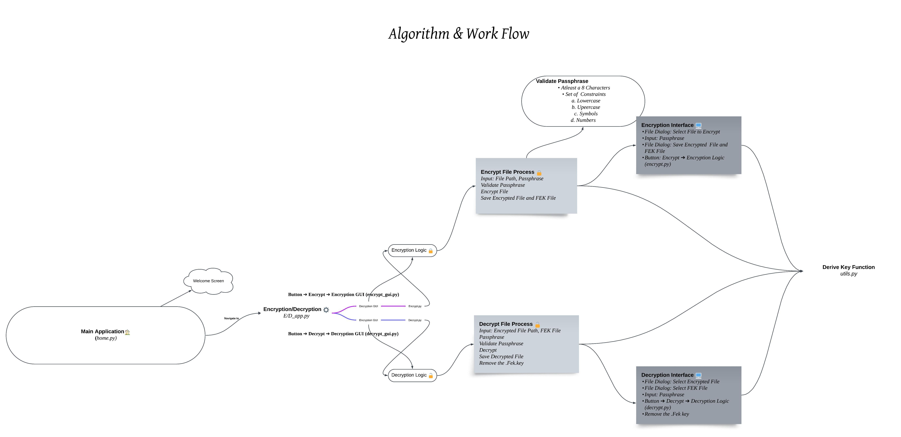
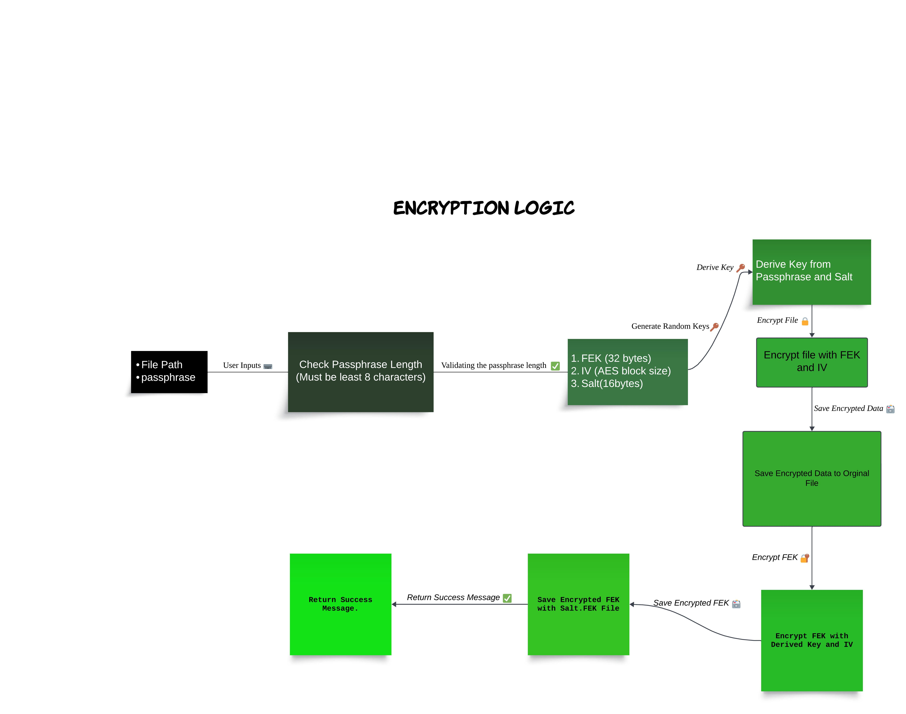
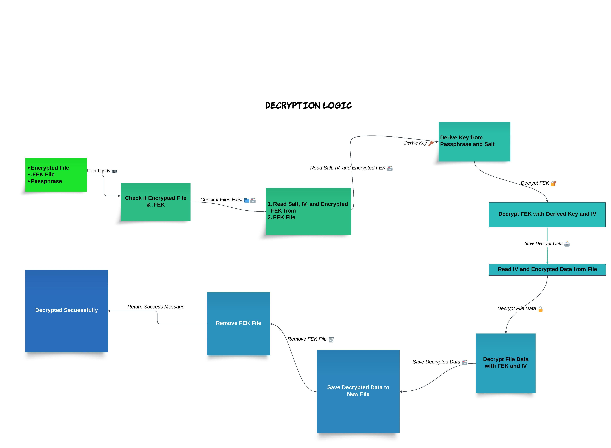
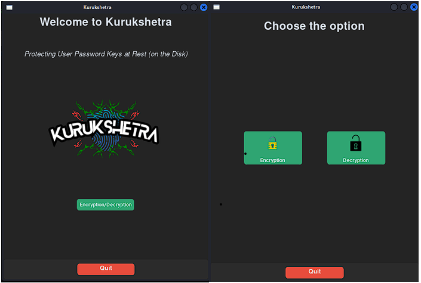
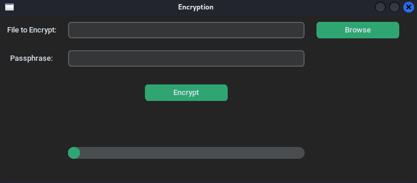
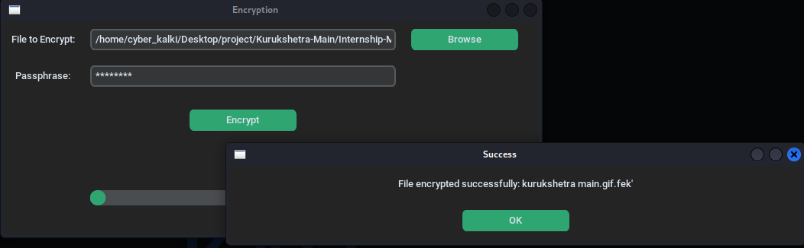
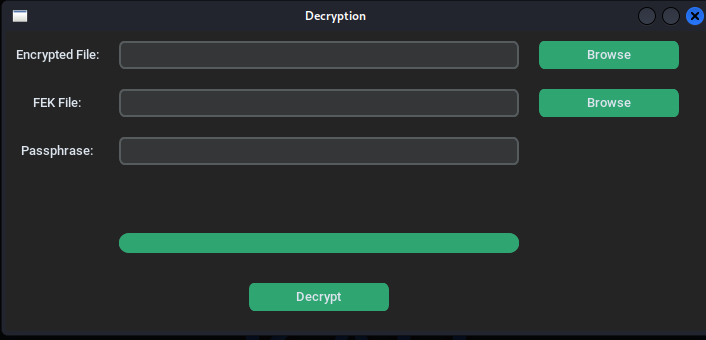
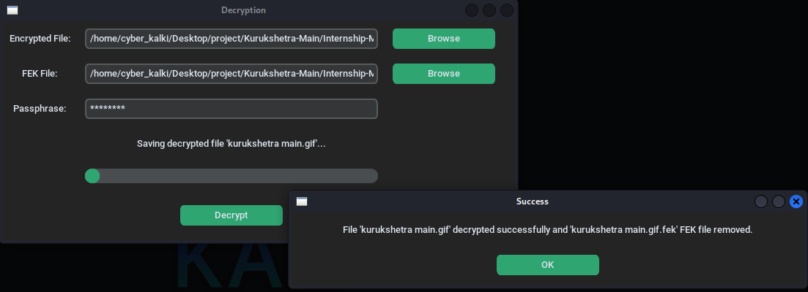

# The Kurukshetra

Kurukshetra symbolizes a monumental battle, drawing a parallel to the critical importance of securing files and data with utmost confidentiality.

<center></center>

## Table of Contents

- [Overview](#overview)
- [Features](#features)
- [Installation](#installation)
- [Running the Application](#running-the-application)
- [Application Workflow](#application-workflow)
- [Result](#result)
- [File Structure](#file-structure)


## Overview

In the epic Mahabharata, Kurukshetra symbolizes a monumental battle, drawing a parallel to the critical importance of securing files and data with utmost confidentiality. Any compromise in file confidentiality can lead to potential data breaches, emphasizing the crucial role of protecting, encrypting, and decrypting data as a vital defense strategy. This analogy inspires the project's title, Kurukshetra.

## Features

- Encrypt files with a secure passphrase
- Decrypt files with the corresponding passphrase
- Validate passphrases to ensure they meet security criteria
- User-friendly GUI built with CustomTkinter
- Progress indicators and status updates for encryption/decryption processes

## Installation

1. Clone the repository:
   ```sh
   git clone https://github.com/cyber5kalki/Kurukshetra-Main.git
   cd Kurukshetra-Main
    ```
2. Install the required dependencies:
    ```sh
    pip install -r requirements.txt
    ```
### Running the Application

1. Navigate to the project directory:
    ```sh
    cd Internship-Main
    ```
2. Run the main application:
    ```sh
    python -u home.py
    ```

## Application Workflow
The application's workflow is designed to provide a seamless experience for users. The following steps outline the process

1. **User Input:**
   - The user selects a file or directory to encrypt.
   - The user provides a passphrase.

2. **Encryption Process:**
   - Generate a random File Encryption Key (FEK).
   - Encrypt the file or directory using AES-256 with the FEK.
   - Use a Key Derivation Function (KDF) to generate a key from the user's passphrase and with validation criteria.
   - Encrypt the FEK using the derived key and store it securely.

3. **Decryption Process:**
   - The user provides the passphrase.
   - Use the KDF to generate the key from the passphrase.
   - Decrypt the FEK using the derived key.
   - Decrypt the file or directory using the FEK.

4. **Work Flow**


5. **Encrypt(Work Flow)**


6. **Decrypt(Work Flow)**


## Result

1. *home-app*


2. *encrypt-app*


3. *encrypt-save*


4. *decrypt-app*


5. *decrypt-save*


6. *Kurukshetra-Demo-Video*
[](https://drive.google.com/file/d/1PQQepLfM7AC0A-OVkK75TcMMQ2jjSzTy/view?usp=sharing)


## File Structure
```plaintext
kurukshetra-Main/
├── README.md
├── src/                    # Directory for Project resource files
└── Internship-Main/
    ├── assets/             # Directory for various Random files
    ├── images/             # Directory for image files
    ├── home.py             # File handling setup and initial execution
    ├── encryption_decryption_app.py   # Main application file for encryption and decryption
    ├── encrypt.py          # Logic file for encryption
    ├── decrypt.py          # Logic file for decryption
    ├── utils.py            # Utility functions
    ├── encrypt_gui.py      # Graphical interface for encryption
    ├── decrypt_gui.py      # Graphical interface for decryption
    └──requirements.txt


    
